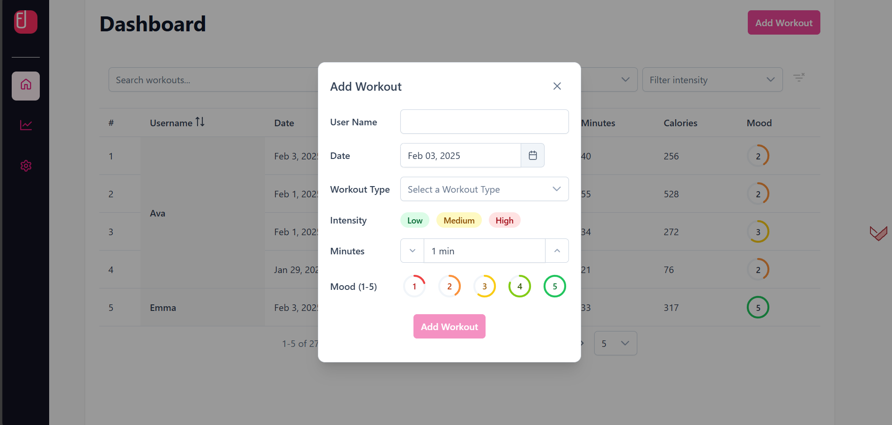
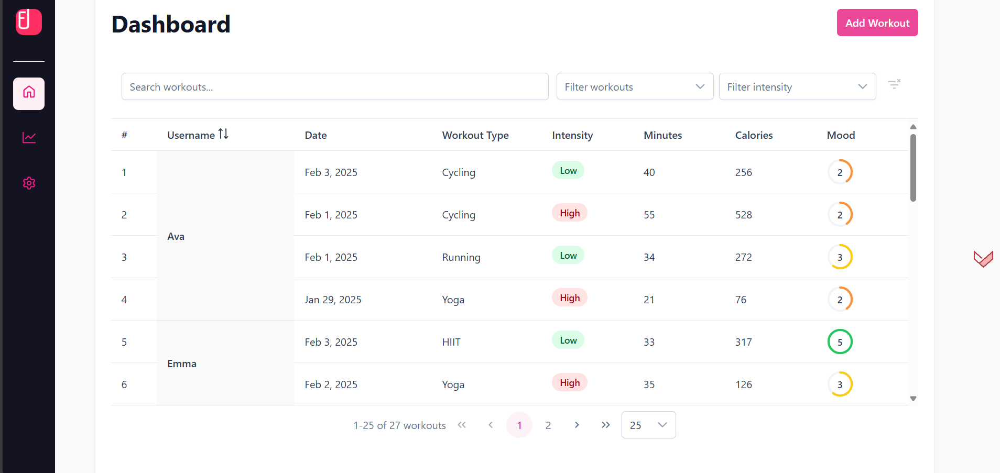
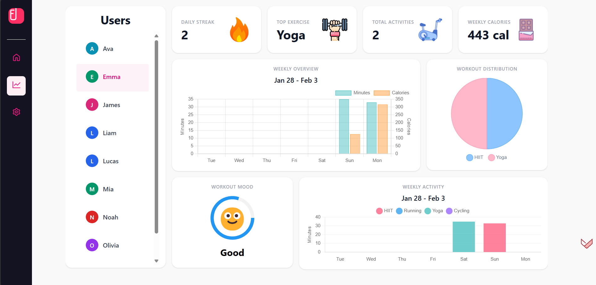
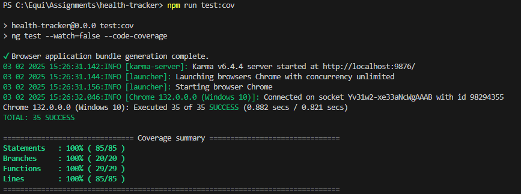

# Health Tracker

A modern, responsive SPA for tracking and analyzing workout activities. Built with Angular and PrimeNG, featuring real-time analytics, detailed workout logging, and intuitive data visualization.

## Features

- 📊 Real-time workout analytics and trends
- 🏃‍♂️ Multiple workout type support (Running, Yoga, HIIT, Cycling)
- 📈 Visual data representation with charts
- 🔍 Advanced filtering and search capabilities
- 💾 Local storage persistence
- 🎨 Modern UI with PrimeNG components

<br>







## Tech Stack

- Angular 19
- PrimeNG
- Tailwind
- TypeScript
- SCSS
- Jasmine/Karma for testing

## Prerequisites

- Node.js (v18.x or higher)
- npm (v9.x or higher)
- Angular CLI (v19.x)

## Getting Started

1. Clone the repository:

```bash
git clone https://github.com/Koruto/Health-Tracker
cd workout-tracker
```

2. Install dependencies:

```bash
npm install
```

3. Start the development server:

```bash
ng serve
```

4. Open your browser and navigate to `http://localhost:4200`

## Project Structure

```
src/
┣ app/
┃ ┣ components/
┃ ┃ ┣ layout/
┃ ┃ ┃ ┣ main-layout/
┃ ┃ ┃ ┗ sidebar/
┃ ┃ ┗ workout/
┃ ┃   ┣ workout-analytics/
┃ ┃ ┃ ┃ ┣ components/
┃ ┃ ┃ ┃ ┃ ┣ calories-summary-card/
┃ ┃ ┃ ┃ ┃ ┣ mood-donut/
┃ ┃ ┃ ┃ ┃ ┣ mood-summary-card/
┃ ┃ ┃ ┃ ┃ ┣ most-active-exercise-card/
┃ ┃ ┃ ┃ ┃ ┣ streak-card/
┃ ┃ ┃ ┃ ┃ ┣ total-activities-card/
┃ ┃ ┃ ┃ ┃ ┣ weekly-activity-chart/
┃ ┃ ┃ ┃ ┃ ┣ weekly-overview-chart/
┃ ┃ ┃ ┃ ┃ ┗ workout-distribution-chart/
┃ ┃   ┣ workout-dashboard/
┃ ┃   ┣ workout-form/
┃ ┃   ┗ workout-table/
┃ ┣ data/
┃ ┃ ┗ initial-workouts.ts
┃ ┣ interfaces/
┃ ┃ ┣ daily-workout.ts
┃ ┃ ┣ exercise-summary.ts
┃ ┃ ┣ workout-types.ts
┃ ┃ ┗ workout.ts
┃ ┣ services/
┃ ┃ ┣ navigation/
┃ ┃ ┃ ┗ navigation.service.ts
┃ ┃ ┗ workout/
┃ ┃   ┣ workout.service.spec.ts
┃ ┃   ┗ workout.service.ts
┃ ┣ app.component.html
┃ ┣ app.component.scss
┃ ┣ app.component.ts
┃ ┗ app.config.ts
┣ index.html
┣ main.ts
┗ styles.scss
```

## Components Overview

### Workout Dashboard

- `WorkoutListComponent`: Displays workouts in a filterable, sortable table
  - Features: Advanced filtering, sorting, pagination
  - Tests: Coverage for filter logic, pagination, and data display

### Analytics

- `WorkoutAnalyticsComponent`: Visualizes workout data and trends
  - Features: Interactive charts, trend analysis

### Form Handling

- `WorkoutFormComponent`: Handles workout data entry
  - Comprehensive form validation
  - Real-time calorie calculation
  - Support for multiple workout types

### Layout

- `MainLayoutComponent`: Main application layout structure
- `NavSidebarComponent`: Navigation and app controls
  - Smooth scroll navigation
  - Data reset functionality

## Testing

The project uses Jasmine and Karma for testing. Key test coverage includes:

```bash
npm test             # Run unit tests
npm run test:cov     # Run for coverage report
```

### Test Coverage Areas

- Form validation and submission
- Data filtering and sorting
- Service methods and state management
- Component lifecycle and interactions

Example test pattern for components:

```typescript
describe('WorkoutListComponent', () => {
  // Setup and initialization tests
  // Filter functionality tests
  // Pagination tests
  // Service interaction tests
});
```

### Test Coverage Report


